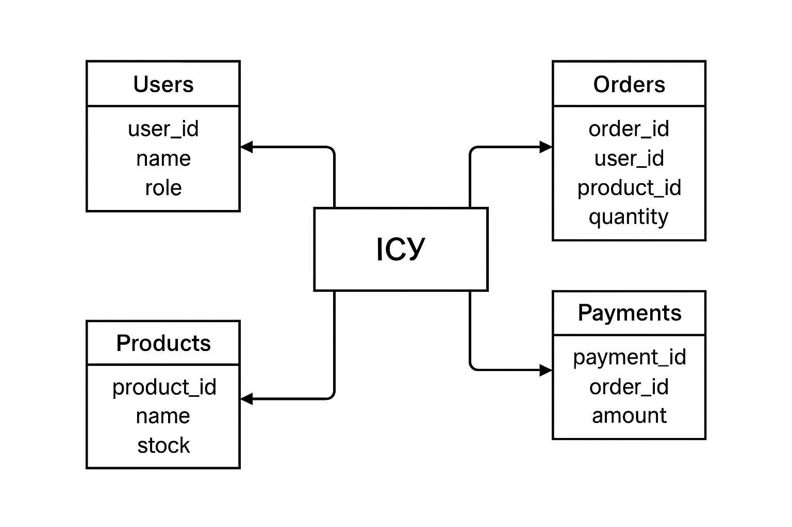

# 📘 Software Requirements Specification (SRS)
## **Інформаційна система управління (ІСУ) ТОВ «Ластівка»**

---

### **Автор:**  
**Красносільська Діана**

---

## **Зміст**
1. [Вступ](#1-вступ)  
   1.1 [Мета документа](#11-мета-документа)  
   1.2 [Область застосування](#12-область-застосування)  
   1.3 [Термінологія, скорочення та абревіатури](#13-термінологія)  
   1.4 [Посилання](#14-посилання)  
   1.5 [Огляд документа](#15-огляд-документа)  
2. [Загальний опис](#2-загальний-опис)  
   2.1 [Контекст продукту](#21-контекст-продукту)  
   2.2 [Функції продукту](#22-функції-продукту)  
   2.3 [Характеристика користувачів](#23-характеристика-користувачів)  
   2.4 [Обмеження](#24-обмеження)  
   2.5 [Припущення та залежності](#25-припущення-та-залежності)  
3. [Специфічні вимоги](#3-специфічні-вимоги)  
   3.1 [Зовнішні інтерфейси](#31-зовнішні-інтерфейси)  
   3.1.1 [Інтерфейс користувача](#311-інтерфейс-користувача)  
   3.1.2 [Програмні інтерфейси](#312-програмні-інтерфейси)  
   3.1.3 [Апаратні інтерфейси](#313-апаратні-інтерфейси)  
   3.1.4 [Комунікаційні інтерфейси](#314-комунікаційні-інтерфейси)  
   3.2 [Функціональні вимоги](#32-функціональні-вимоги)  
   3.3 [Вимоги до продуктивності](#33-вимоги-до-продуктивності)  
   3.4 [Вимоги до безпеки](#34-вимоги-до-безпеки)  
   3.5 [Вимоги до надійності та доступності](#35-вимоги-до-надійності-та-доступності)  
   3.6 [Атрибути програмної системи](#36-атрибути-програмної-системи)  
   3.7 [Матриця відстеження вимог](#37-матриця-відстеження-вимог)  
4. [Додатки](#4-додатки)  
   4.1 [DFD — Діаграма потоків даних](#41-dfd)  
   4.2 [ER — Діаграма зв’язків сутностей](#42-er)  
   4.3 [Глосарій](#43-глосарій)  
   4.4 [Посилання на джерела](#44-посилання-на-джерела)

---

## 1. Вступ

### 1.1 Мета документа
Цей документ описує вимоги до **Інформаційної системи управління (ІСУ)** для ТОВ «Ластівка».  
Система призначена для автоматизації процесів управління персоналом, замовленнями, складом і фінансами підприємства.

---

### 1.2 Область застосування
Система використовується всередині компанії для централізованого керування бізнес-процесами.  
**Основні користувачі:** менеджери, адміністрація, касири, складські працівники.  
Середовище роботи: **Windows / Linux**, вебінтерфейс через браузер.

---

### 1.3 Термінологія, скорочення та абревіатури

| Термін | Визначення |
|--------|-------------|
| **ІСУ** | Інформаційна система управління |
| **GUI** | Графічний інтерфейс користувача |
| **DBMS** | Система керування базами даних (PostgreSQL) |
| **Замовлення** | Процес оформлення покупки клієнтом |
| **Склад** | Підрозділ для зберігання товарів |

---

### 1.4 Посилання
- IEEE 830-1998 – *Software Requirements Specification Standard*  
- ISO/IEC/IEEE 29148:2018 – *Systems and Software Engineering – Life Cycle Processes*  
- Документація PostgreSQL, C#, ASP.NET  

---

### 1.5 Огляд документа
Документ описує загальний вигляд продукту, функціональні та нефункціональні вимоги, інтерфейси та структуру системи.

---

## 2. Загальний опис

### 2.1 Контекст продукту
**ІСУ ТОВ «Ластівка»** — це веборієнтована система для управління діяльністю компанії, з інтеграцією модулів замовлень, персоналу, фінансів та складу.

---

### 2.2 Функції продукту
1. Авторизація користувачів із різними рівнями доступу  
2. Управління замовленнями (створення, редагування, видалення)  
3. Облік товарів і запасів на складі  
4. Формування звітів по фінансах і продажах  
5. Адміністрування користувачів та прав доступу  

---

### 2.3 Характеристика користувачів
| Роль | Дії |
|------|-----|
| **Адміністратор** | Управління користувачами, системними налаштуваннями |
| **Менеджер** | Створення й обробка замовлень, звіти |
| **Касир** | Прийом оплат, друк чеків |
| **Складський персонал** | Оновлення інформації про товари |

---

### 2.4 Обмеження
- Підтримка не більше **100 одночасних користувачів**  
- Використання **PostgreSQL 15+**  
- Робота в браузерах: Chrome, Edge, Firefox  
- Мінімальна роздільна здатність екрана: **1366×768**

---

### 2.5 Припущення та залежності
- Залежить від наявності стабільного інтернет-з’єднання  
- Інтеграція з корпоративною базою даних  
- Резервне копіювання виконується автоматично  

---

## 3. Специфічні вимоги

### 3.1 Зовнішні інтерфейси

#### 3.1.1 Інтерфейс користувача
- Головна панель із навігацією (Замовлення, Склад, Звіти, Користувачі)  
- Вікно авторизації з перевіркою логіну та пароля  
- Система повідомлень та фільтрів у таблицях

#### 3.1.2 Програмні інтерфейси
- API-з’єднання з базою даних PostgreSQL  
- REST API для модулів клієнтської частини  
- Інтеграція з сервісами електронної пошти для сповіщень

#### 3.1.3 Апаратні інтерфейси
- Серверна машина: мін. 8 GB RAM, 4 CPU  
- Клієнтські пристрої: ПК, ноутбук, планшет  

#### 3.1.4 Комунікаційні інтерфейси
- HTTP/HTTPS  
- SSL/TLS шифрування  
- Підтримка WebSocket для оновлення даних у реальному часі  

---

### 3.2 Функціональні вимоги

| № | Назва | Опис | Пріоритет |
|---|--------|--------|------------|
| FR1 | Реєстрація користувачів | Створення облікових записів | Високий |
| FR2 | Авторизація | Вхід через логін/пароль | Високий |
| FR3 | Управління замовленнями | CRUD-операції над замовленнями | Високий |
| FR4 | Управління складом | Оновлення даних про товари | Високий |
| FR5 | Звіти | Формування фінансових і складських звітів | Середній |
| FR6 | Контроль доступу | Призначення ролей користувачам | Високий |
| FR7 | Резервне копіювання | Автоматичне створення бекапів | Середній |

---

### 3.3 Вимоги до продуктивності
- Обробка до **100 одночасних запитів**  
- Середній час відповіді — не більше **2 с**  
- Використання кешування для швидкого доступу до даних  

---

### 3.4 Вимоги до безпеки
- Авторизація через HTTPS  
- Шифрування паролів (SHA-256 або bcrypt)  
- Обмеження доступу за ролями (RBAC)  
- Логи дій користувачів  

---

### 3.5 Вимоги до надійності та доступності
- Відмовостійкість — **99,5 % uptime**  
- Автоматичне резервне копіювання щодоби  
- Система сповіщень про помилки серверу  

---

### 3.6 Атрибути програмної системи
| Атрибут | Опис |
|----------|------|
| **Масштабованість** | Підтримка розширення функціоналу |
| **Зручність користування (UX/UI)** | Інтуїтивний інтерфейс |
| **Портативність** | Робота на Windows, Linux |
| **Підтримка** | Модульна структура для легкого оновлення |

---

### 3.7 Матриця відстеження вимог

| Вимога | Модуль | Тестовий сценарій |
|---------|---------|--------------------|
| FR1 | Авторизація | TC-01 Реєстрація нового користувача |
| FR3 | Замовлення | TC-04 Створення нового замовлення |
| FR5 | Звіти | TC-08 Генерація фінансового звіту |
| NFR2 | Надійність | TC-12 Тест резервного копіювання |

---

## 4. Додатки

### 4.1 Контекстна DFD-діаграма
  
*Рис. 1 – Контекстна DFD-діаграма інформаційної системи управління ТОВ «Ластівка»*

---

### 4.2 ERD-діаграма бази даних
  
*Рис. 2 – ERD-діаграма бази даних інформаційної системи управління ТОВ «Ластівка»*
---

### 4.3 Глосарій

| Термін | Визначення |
|---------|-------------|
| **Клієнт** | Замовник або організація, що оформлює покупку |
| **Адміністратор** | Користувач із повними правами |
| **Менеджер** | Користувач, який керує замовленнями |
| **Касир** | Користувач, що відповідає за оплату |

---

### 4.4 Посилання на джерела
1. IEEE 830-1998 — *Standard for Software Requirements Specification*  
2. ISO/IEC/IEEE 29148:2018 — *Requirements Engineering*  
3. Документація PostgreSQL  
4. Матеріали лабораторних робіт ТОВ «Ластівка»

---

> 📝 **Примітка:**  
> Документ розроблено відповідно до стандартів IEEE 830-1998 та ISO/IEC/IEEE 29148:2018.
